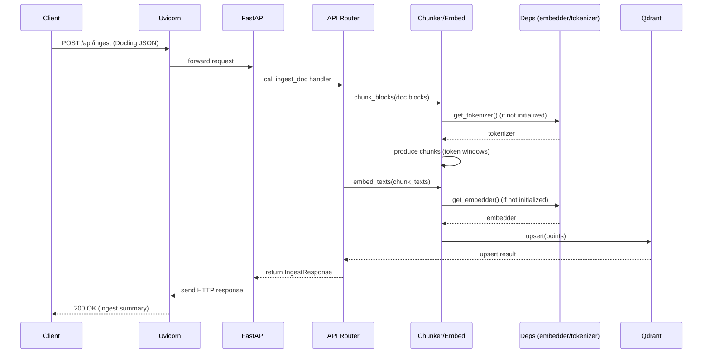

Board Policy Bot — FastAPI Example

Minimal FastAPI project scaffold for the Board Policy Bot.

Quickstart

1. Create a virtualenv and activate it (recommended).
2. Install dependencies:

```bash
python -m pip install -r requirements.txt
Board Policy Bot — FastAPI service

This repository contains a small FastAPI service used as a retrieval/ingest
example for the Board Policy Bot. It demonstrates a simple ingestion pipeline
that chunks text, embeds it, and upserts into a vector store, plus CRUD
endpoints for chunks.

This README documents how to run, debug, and develop locally plus a sequence
diagram showing a typical ingest/search request flow.

--

## Repository layout

- `app/` — FastAPI application code
	- `main.py` — app factory and lifespan startup (model init, debug listener)
	- `routes/api.py` — API router (endpoints: `/api/health`, `/api/ingest`, `/api/chunks`)
	- `deps.py` — lazy/init helpers for heavy runtime deps (embedder, tokenizer)
	- `utilities.py` — chunking, token-aware helpers, embedding wrapper
	- `crud.py`, `schemas.py`, `settings.py` — simple storage and config
- `requirements.txt` — pinned Python deps
- `tests/` — pytest test cases

--

## Quickstart (macOS / zsh)

1. Create and activate a virtual environment (recommended):

```bash
python3 -m venv .venv
source .venv/bin/activate
```

2. Install dependencies:

```bash
pip install -r requirements.txt
```

3. Start the app (development):

```bash
# from repository root
uvicorn app.main:app --reload --host 127.0.0.1 --port 8000 --log-level debug
```

4. Open the OpenAPI docs:

```
http://127.0.0.1:8000/docs
```

5. Run tests:

```bash
pytest -q
```

--

## Environment & settings

The app loads configuration from `app/settings.py` and environment variables.
Defaults are reasonable for local development. If you change embedding model or
Qdrant parameters, update the settings accordingly before ingesting.

--

## API (important endpoints)

- `GET /api/health` — basic health and config information
- `POST /api/create-collection?collection_name=...&vector_dim=...` — ensure/create Qdrant collection
- `POST /api/ingest` — ingest a Docling-style document (JSON) and upsert chunks to Qdrant
- `GET/POST/PUT/DELETE /api/chunks` — simple CRUD over in-memory chunks (example store)

Example: create collection

```bash
curl -X POST "http://127.0.0.1:8000/api/create-collection?collection_name=board-policies_chunks&vector_dim=1024"
```

Example: health

```bash
curl -s http://127.0.0.1:8000/api/health | jq
```

--

## Debugging with VS Code (debugpy attach)

Recommended workflow:

1. Install `debugpy` in the same venv:

```bash
pip install debugpy
```

2. The application starts a non-blocking debugpy listener on port `5678` in
	 development via the app lifespan (if `debugpy` is installed). Start Uvicorn
	 normally (see Quickstart), then attach from VS Code.

3. Example `.vscode/launch.json` attach config (safe to commit):

```json
{
	"version": "0.2.0",
	"configurations": [
		{
			"name": "Attach to FastAPI (debugpy)",
			"type": "python",
			"request": "attach",
			"connect": { "host": "localhost", "port": 5678 },
			"pathMappings": [ { "localRoot": "${workspaceFolder}", "remoteRoot": "${workspaceFolder}" } ],
			"subProcess": true
		}
	]
}
```

Notes:
- Use `subProcess: true` to attach to the worker process when `--reload` is used.
- Do not leave `debugpy.wait_for_client()` or debug listeners enabled in production.

--

## Design notes / runtime behavior

- Heavy ML resources (embedding model + tokenizer) are initialized via
	`app.deps.init_models()` during application lifespan startup. This causes
	the app to fail fast when a model is misconfigured or missing.
- To avoid circular imports and keep module imports light, `app.deps` exposes
	lazy getters (`get_embedder()` / `get_tokenizer()`) used by `utilities.py`.
- Chunking is token-aware and heading-aware (see `app/utilities.py`) and
	preserves `section_path`, `block_ids`, and token counts for each chunk.

--

## Sequence diagram (ingest flow)

Below is a Mermaid sequence diagram describing a typical `POST /api/ingest`
request and how it flows through the system. Many steps are simplified for
clarity.



--

## CI / tests

- Tests are run with `pytest`. The test suite uses lightweight imports to
	avoid loading heavy models; heavy integration tests should be run in a CI
	environment with the required dependencies installed.

--

## Should I commit `.vscode/launch.json`?

- If the launch config is generic (uses `${workspaceFolder}` path mappings and
	no secrets) it's useful to commit and share. If it contains local absolute
	paths or personal preferences, keep it out of VCS and provide a
	`launch.json.example` instead.

--

If you'd like, I can also:
- add a committed `/.vscode/launch.json.example` and update `.gitignore` to
	ignore local `/.vscode/launch.json`, or
- add example Docling JSON and a small script to run a sample ingest.

Questions? Tell me which of those you'd like and I'll patch the repo.
