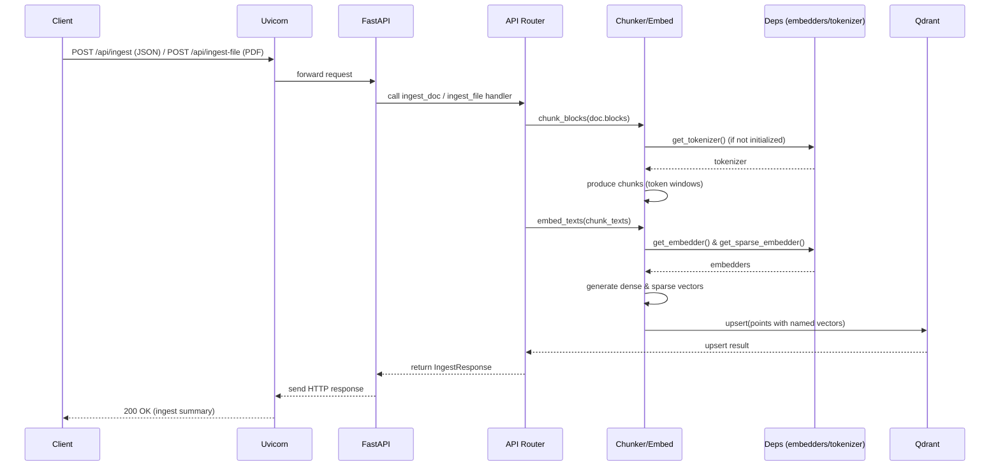

# Architecture

Technical overview of the Board Policy Bot system — components, data flow, and design decisions.

---

## System Components

| Component | Technology | Purpose |
|---|---|---|
| **Ingest API** | FastAPI (Python) | Parses PDFs, chunks text, generates embeddings, upserts to Qdrant |
| **Vector Store** | Qdrant | Stores dense + sparse named vectors for hybrid search |
| **Embedding — Dense** | BGE-M3 (sentence-transformers) | Semantic similarity search |
| **Embedding — Sparse** | SPLADE (fastembed) | Keyword / lexical search |
| **Frontend** | OpenWebUI | Staff-facing chat interface |
| **Document Parser** | Docling | Converts PDFs to structured JSON blocks |

---

## Hybrid Search (RRF)

The system uses **Reciprocal Rank Fusion (RRF)** to combine results from:
- **Dense retrieval** — cosine similarity over BGE-M3 embeddings
- **Sparse retrieval** — SPLADE keyword matching

Both vectors are stored as **named vectors** in Qdrant (`"dense"` and `"sparse"`), enabling hybrid queries in a single Qdrant request.

---

## Ingest Flow



---

## Module Responsibilities

| Module | Responsibility |
|---|---|
| `app/main.py` | App factory, lifespan startup (model init, debug listener) |
| `app/routes/api.py` | All API endpoints |
| `app/deps.py` | Lazy singleton getters for ML models — avoids circular imports |
| `app/utilities.py` | Token-aware chunking, embedding wrapper |
| `app/settings.py` | Pydantic settings loaded from environment |
| `app/schemas.py` | Request/response Pydantic models |
| `app/crud.py` | In-memory chunk store (for dev/testing) |

---

## Azure Production Architecture

```
                    ┌──────────────────────────────────┐
                    │       Azure Container Apps        │
                    │                                   │
  Staff Browser ───►│  OpenWebUI  ──►  Ingest API      │
                    │                      │            │
                    │                      ▼            │
                    │                   Qdrant          │
                    │                (Azure Files vol)  │
                    └──────────────────────────────────┘
                                          │
                                          ▼
                               Azure OpenAI (GPT-4o)
```

- All services run in the same **Container Apps Environment** (internal networking)
- Qdrant uses an **Azure Files** volume mount for persistence
- The Ingest API is the only externally-ingressed service (plus OpenWebUI)
- Secrets are managed via **Azure Container Apps secrets** (not committed env vars)

---

## Key Design Decisions

- **Named vectors over separate collections** — keeps dense and sparse retrieval in a single Qdrant collection and enables native RRF queries.
- **Fail-fast model init** — models are loaded at app startup (lifespan), not lazily per request, so misconfigurations surface immediately rather than at first ingest call.
- **Docling for PDF parsing** — produces structured block-level JSON that enables heading-aware chunking and preserves document hierarchy in chunk payloads.
